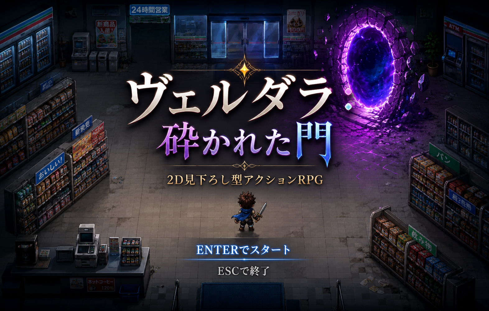

# ヴェルダラ：砕かれた門

## 実行環境の必要条件
* Python >= 3.10
* pygame >= 2.1
* タイトル画面・背景はAI生成絵を利用しているためfigフォルダが必要
* BGM・SEはフリー素材を利用しているため、soundフォルダが必要

## ゲームの概要
* プレイヤーが銃を使って敵（おにぎり）と戦う2D見下ろし型アクションゲームです。
* プレイヤーがコンビニへ向かう最中におにぎりが襲ってくるため、持っている武器を駆使して敵を倒し続けましょう。

## ゲームの遊び方
* `W`，`A`，`S`，`D`キーまたは矢印キーでプレイヤーを移動する
* `J`で射撃 `K`で近接攻撃ができます。　
* 経験値が一定量に達するとレベルアップし，HP，Ammo（弾の数），Attack，Speed　スキルのどれかを一つ選び得ることができる
* `R`で銃をリロードしてMPを満タンにできる
* `Q`で持つ銃を変える（ショットガンとアサルトライフルの二種類）
* ショットガン：Ammoを2個消費してV字型に射撃ができる。威力は高い代わりに当てるのが難しいのが特徴
* アサルトライフル：単発射撃だが再発射までの時間が短く、まっすぐ撃てるのが特徴
* レベルアップでヒールスキルを取得した後は`L`でヒールスキルを使い、HPを回復できる
* ヒールスキルは一度消費すると再使用まで一定時間必要（Ammoは消費しない）
* HP、Ammo、スキルの再使用までの時間は右上に表示
* 銃の種類、弾の数は右下に表示されている
* 敵を倒した数は左上に表示されている
* 左下には基本操作の仕方が表示されている
* 一定数の敵を倒した場合にボスが出現する
* 通常画面で`ESC`キーを押すとゲームを終了する
* ステージ数は2つ
* ステージ2のボスを倒したらゲームクリア。ESCキーを押して終了します。
* HPが0になるとゲームオーバーになり、ESCキーを押してゲームを終了します。

## ゲームの実装
### 共通基本機能
* Pygameによるゲームウィンドウとゲームループ
* 見下ろし型マップの描画
* プレイヤーの移動と画面内での位置制限
* 敵の追跡，攻撃，当たり判定
* HP，MP，EXP，レベルアップの管理
* 基本GUI（HPバー，MPバー，EXPバー, 現在の銃）
* `os.chdir(os.path.dirname(os.path.abspath(__file__)))` により，実行場所に依存しないファイルパス処理

### 分担追加機能
* 銃の種類を増やす(担当：C0C25086 山形周平)：アサルトライフル、ショットガンの追加+銃切り替えキーの実装✅
* mob敵の種類を増やす(担当：C0A25268 小林藍太)：焼きおにぎり、オムライスおにぎりの追加 ✅
* ステージを追加する(担当：C0A25012 アルネヤディサイード)：タイトル画面、ステージ背景、ステージの移動方法、BGM、SEの追加  ✅
* ボスの追加2体(担当：C0A25120 島田寛生)：ステージ１のボス（ケチャップ）とステージ２（海老天）のボスを作成 ✅

## ToDo
* ヒール以外のスキルの追加をする予定だった。